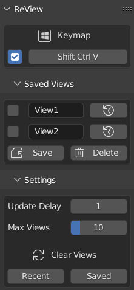

# ReView v1.0.0

## Recent Views

- Press `Ctrl` `Shift` `V` to open the ReView pie menu
- All you need to do to start automatically saving views is turn ReView on
- Once ReView is active, it will capture the viewport view at regular intervals set by the user
- If you stay in the same view for one or more intervals, that view will be saved
- Use the pie menu buttons to restore recent views
  - `Recent`: Restore the most recently saved view
  - `Previous`: Restore the last saved recent view
  - `Next`: Restore the next saved recent view
- The numbers under the toggle button will show which view has been restored last and how many recent views are saved

## Saved Views

- Press `Save` to save the current view
- The view will be added to the ReView panel and can be restored with one click
- Saved views can be named to make it easy to know which view is which

## Installation

- Download ReView
  - Either go to [Releases](https://github.com/DanielBoxer/ReView/releases/latest) and download the `ReView.py` file for the latest stable version
  - Or press the `Code` button at the top of the page and then `Download ZIP` for the newest experimental version (don't extract it)
- In Blender, open `Preferences` and go to `Add-ons`
- Click `Install`
- Select the download in the file browser
- Click `Install Add-on`
- Enable the add-on by checking the box
